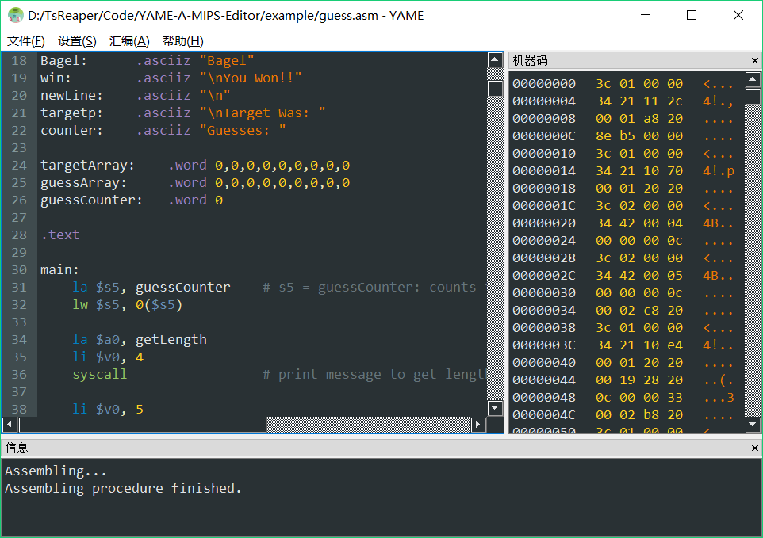
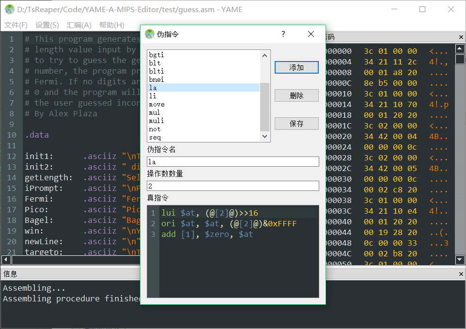
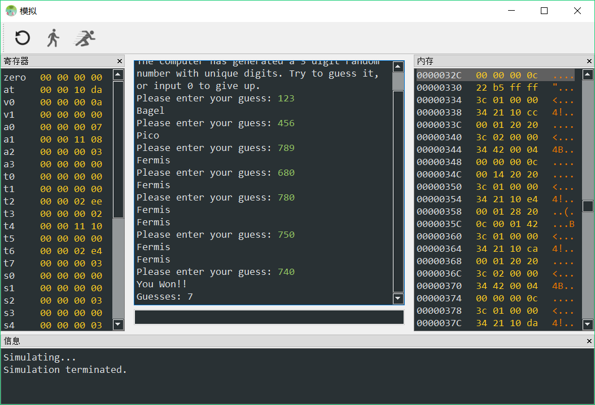

# YAME: A MIPS Editor
YAME 是一个简单的 MIPS 编辑器 / 汇编器 / 反汇编器 / 模拟器，并带有图形界面。它是我为浙江大学《计算机组成》课程（教师：LXQ）编写的课程项目。

YAME 是 YAME: A MIPS Editor 的缩写，也可以认为是 Yet Another MIPS Editor 的缩写。

## 预览

## 特性
- 支持语法高亮；
- 支持自定义伪指令；
- 支持 .asm 汇编文件汇编为 .coe 文件或 .bin 文件；
- 支持 .coe 文件或 .bin 文件反汇编为 .asm 汇编文件汇编为；
- 支持模拟运行，支持模拟终端输入输出；
- 支持简单的调试功能（单步运行、全部运行、查看寄存器与内存的值）。

## 指令集
YAME 支持以下指令的汇编、反汇编与模拟。

支持的 R 指令有：
- add
- addu
- and
- div
- divu
- jalr
- jr
- mfhi
- mflo
- mthi
- mtlo
- mult
- multu
- nor
- or
- sll
- sllv
- slt
- sltu
- sra
- srav
- srl
- srlv
- sub
- subu
- syscall（部分）
- xor

支持的 I 指令有：
- addi
- addiu
- andi
- beq
- bgez
- bgezal
- bgtz
- blez
- bltz
- bltzal
- bne
- lb
- lbu
- lh
- lhu
- lui
- lw
- ori
- sb
- slti
- sltiu
- sh
- sw
- xori

支持的 J 指令有：
- j
- jal

支持的格式指令有：
- .text
- .data
- .2byte
- .4byte
- .8byte
- .ascii
- .asciiz
- .byte
- .dword
- .half
- .space
- .word

支持的 syscall 功能有：
- 1（输出整数）
- 4（输出字符串）
- 5（输入整数）
- 8（输入字符串）
- 10（退出）
- 11（输出字符）
- 12（读入字符）
- 30（读入系统时间）
- 41（随机整数）
- 42（有范围的随机整数）

## 伪指令
YAME 最大的亮点是对自定义伪指令的支持。打开“设置 - 伪指令”窗口，即可添加、删除或修改伪指令。

用户提供伪指令名、操作数数量与对应的真指令后，YAME 会在汇编时将伪指令转换为对应真指令。

在“真指令”部分中，可以填入 `[x]` 表示第 x 个操作数。用 `@` 包围的标签名代表该标签的地址。例如，`@[2]@` 表示第 2 个操作数的地址（要求第 2 个操作数必须是标签）。

YAME 的配置文件中，已经编写好了一些伪指令，可以打开伪指令窗口进行查看与修改。

## 模拟
YAME 具有简单的模拟与调试功能。“模拟”界面是一个简单的模拟终端，可以通过 syscall 指令向终端输出信息，或从终端读入用户输入信息。终端输出信息用白色字表示，用户输入信息用绿色字表示。

可以使用 test 文件夹中的 guess.asm 文件（一个猜数字游戏，[原 github 地址点此](https://github.com/plazagonzalezd/MIPS-Game)，guess.asm 文件在原文件基础上有修改）测试 YAME 的汇编与模拟功能。